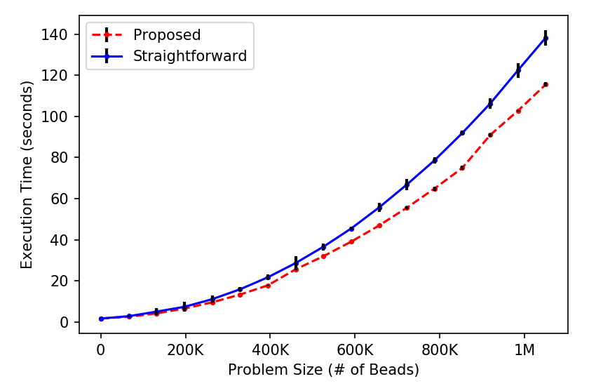
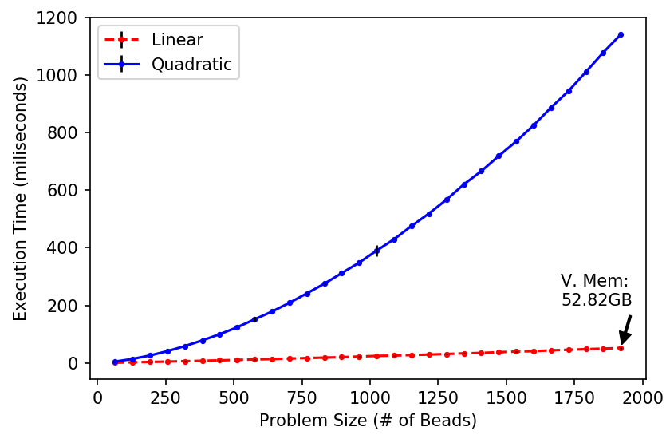

Elf Collision Count
===

<a href="https://mjsaldanha.com"></a>

High-performance implementations for counting collisions among objects in the three dimensional space.

Index
---

- [Introduction](#intro)

- [CUDA Usual Approach](#nsteps-singlerow)

- [CUDA Proposed Approach](#halfsteps-singlerow)

- [Sequential Linear](#sequential-linear)

- [Usage](#usage)

- [Comparison](#comparison)


<a name="intro"></a>
Introduction
---

In this directory, I provide a few procedures that count the number of collisions within a vector of beads in the three dimensional space. Some of the procedures are sequential, and some were implemented in parallel using the CUDA programming model. The sequential ones calculate interactions in the integer space, whereas the CUDA implementations work on floating point space.

The most basic sequential code is as follows
```c
int interactions = 0;
for(i = 0; i < vecSize-1; i++){
  for(j = i+1; j < vecSize; j++){
    interactions += interact(vector[i], vector[j]);
  }
}
```
where *vector* is an array of beads in the tri-dimensional space; that is, each element in the vector is a structure containing 3 numbers (integer or real), one for each coordinate on each axis. `interacts` is any predicate that receives 2 beads as argument; however, not all predicates will work with the Sequential_Linear approach explained later.

In the following sections, each paralellization is explained in further detail.

<a name="nsteps-singlerow"></a>
CUDA Usual Approach
---

This was the first CUDA paralellization proposed, and it is derived directly from the sequential code presented earlier. The parallelization is achieved by simply implementing the outer *for* loop to be executed in parallel, which means we launch *N* threads, and each thread *i* evaluates the collision of the bead *vector[i]* with all beads *vector[j]* where *j > i*. After all threads finish, we apply a reduce operation to accumulate all collisions calculated by each thread individually.

To implement this in CUDA, the initial vector with *N* beads is virtually split into "segments" of 1024 beads each. Then we launch a block of 1024 threads that will take care of each segment, and within a block each thread takes care of only one bead. Thread *i* in block *j* takes care of bead *i* in segment *j*; this means this thread compares its bead B with all beads that come after B in the initial vector. This distribution can be better visualized in the figure below.


To use the GPU memory efficiently, each thread reads in a register the element it is in charge of. Each block of threads processes segments sequentially; block *i* has to process segments *i*, *i+1*, *i+2* and so on. For efficiency, we use **shared memory as a cache for segments**. Initially the block reads segments *i* and *i+1* in shared memory; when it finishes processing all elements in segment *i*, it reads segment *i+2* over the memory freed by dumping the segment *i*. This goes on until all segments are processed.

The first thread among all threads launched has to compare bead *0* with all beads following it, giving a total of *N-1* operations. Hence, the depth of this algorithm is *N-1*.


<a name="halfsteps-singlerow"></a>
CUDA Proposed Approach
---

This parallelization involves a change in the simple sequential algorithm shown previously. There, each bead is compared the all following beads, until the last bead is reached. Here, each bead is compared to the following beads, but when the end is reached we compare with the beads *0*, *1*, and so forth. In this fashion, each bead has to be compared with *s\** beads that follow, where *s\** depends on the value of *N*, the number of beads in the vector:

1. If *N* is odd, *s\* = (N-1)/2*;

2. If *N* is even, *s\* = (N-2)/2* and the **first half** of the beads must execute **1 more comparison**.

The memory usage of our implementation is similar to that in Section *NSteps SingleRow*. The vector of *N* beads is divided in segments of 1024 beads, and we launch a block of threads for each segment; block *i* will compare the beads of segment *i* with beads in the segments *i*, *i+1* and so forth. Each thread is responsible for one bead, which is read in a register, and the the segments are iteratively read in shared memory, which is used as a **cache for segments**. Initially, we read segments *i* and *i+1* into shared memory; when segment *i* is fully processed, we read segment *i+2* in its place.

This implementation has depth *s\* + 1 = N/2*, in the even *N* case.


<a name="sequential-linear"></a>
Sequential Linear
---

This is a sequential implementation with *O(n)* complexity. In this implementation we allocate a tri-dimensional array of *char*. The element *x,y,z* of this array should store how many beads there are in the position *x,y,z* in the tri-dimensional space. For this to work, we need:

1. The allocated array must be big enough to cover all possible locations of the beads;

2. The beads' coordinates must be integer values, i.e. the space where beads are located must be discrete.

This implementation is motivated by the problem of Protein Structure Prediction, because some prediction algorithms model the protein as a set of connected beads whose coordinates are integers. Also, since the beads are connected as a chain, the space occupied by the protein is limited; that is, a protein with *N* beads can't exceed a space whose axes have dimensions of about *2 \* N*.

The steps of the algorithm are:

1. Allocate a tri-dimensional array of sufficient size;

2. For each bead in the vector, take the bead position *x,y,z* and set the element *x,y,z* of the array to 0;

4. Create a *collision* variable initialized to 0;

5. For each bead in the vector, take its position *x,y,z*, read the element *x,y,z* of the array in variable *K*, then

	1. increment *collision* in *K* units;

	2. increment the element *x,y,z* of the array in 1 unit;

Each of the steps is *O(n)* so the whole procedure is also *O(n)*.


<a name="usage"></a>
Usage
---

For using the collision procedures in your project, copy the due **.h** and **.c** files in your project's directory, and you can include the procedures as follows:

```c
// program.c
#include <stdio.h>

#include "CUDA_Proposed_Alg.h"

int main(int argc, char *argv[]){
	ElfFloat3d vector[] = {
		{0, 0, 0},
		{0, 0, 0},
		{1, 1, 1},
		{1, 1, 1}
	};

	struct CollisionCountPromise promise = count_collisions_launch(vector, 4);

	int collisions = count_collisions_fetch(promise);

	printf("Collisions: %d\n", collisions);

	return 0;
}
```

And to compile we can use the commands

```
nvcc program.c CUDA_Proposed_Alg.cu -o prog
```

And running the program would give

```
./prog
Collisions: 2
```


<a name="comparison"></a>
Comparison
---

Experiments were made to compare all the implementations. The CUDA experiments were done using an NVIDIA Tesla P100, and the sequential ones in an Intel Core i7-4790 3.60GHz.

Experiments with the CUDA programs are shown in the following figure. The linear approach can't handle big problem sizes due to lack of virtual memory, so the sequential programs were experimented separately.



For small problem sizes, the linear approach is a valid candidate, and as can be seen below, it's the best one. See the comparison among the sequential approaches:


