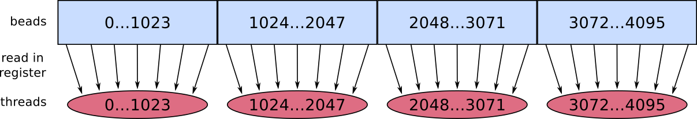

Elf Collision Count
===


High-performance implementations for collision counting on discrete tridimensional space.

Index
---

- [Introduction](#intro)

- [NSteps SingleRow](#nsteps-singlerow)

- [NSteps MultiRow](#nsteps-multirow)

- [HalfSteps SingleRow](#halfsteps-singlerow)

- [SingleSteps AllThreads](#singlesteps-allthreads)

- [SingleSteps HalfThreads](#singlesteps-halfthreads)

- [Sequential Linear](#sequential-linear)

- [Usage](#usage)

<a name="intro"></a>
Introduction
---

In this directory, I provide a few procedures that count the number of collisions within a vector of beads in the integer tridimensional space. Some of the procedures are sequential, and some were implemented in parallel using the CUDA programming model.

The most basic sequential code is as follows
```c
int collisions = 0;
for(i = 0; i < vecSize-1; i++){
	for(j = i+1; j < vecSize; j++){
		isEqual(vector[i], vector[j]){
			collisions += 1;
		}
	}
}
```
where *vector* is an array of beads in the tri-dimensional integer space; that is, each element in the vector is a structure containing 3 integers, one for each coordinate on each axis.

In the following sections, each paralellization is explained in further detail.


<a name="nsteps-singlerow"></a>
NSteps SingleRow
---

This was the first CUDA paralellization proposed, and it is derived directly from the sequential code presented earlier. The parallelization is achieved by simply implementing the outer *for* loop to be executed in parallel, which means we launch *N* threads, and each thread *i* evaluates the collision of the bead *vector[i]* with all beads *vector[j]* where *j > i*. After all threads finish, we apply a reduce operation to accumulate all collisions calculated by each thread individually.

To implement this in CUDA, the initial vector with *N* beads is virtually split into "segments" of 1024 beads each. Then we launch a block of 1024 threads that will take care of each segment, and within a block each thread takes care of only one bead. Thread *i* in block *j* takes care of bead *i* in segment *j*; this means this thread compares its bead B with all beads that come after B in the initial vector. This distribution can be better visualized in the figure below.



To use the GPU memory efficiently, each thread reads in a register the element it is in charge of. Each block of threads processes segments sequentially; block *i* has to process segments *i*, *i+1*, *i+2* and so on. For efficiency, we use **shared memory as a cache for segments**. Initially the block reads segments *i* and *i+1* in shared memory; when it finishes processing all elements in segment *i*, it reads segment *i+2* over the memory freed by dumping the segment *i*. This goes on until all segments are processed.

The first thread among all threads launched has to compare bead *0* with all beads following it, giving a total of *N-1* operations. Hence, the depth of this algorithm is *N-1*, which explains the first part of this approach's name *NSteps*. It is also called *SingleRow* because the grid of blocks of threads is 1-dimensional.


<a name="nsteps-multirow"></a>
NSteps MultiRow
---

This implementation also parallelizes the outer *for* loop of the simple sequential algorithm presented earlier. What changes here is the parallel implementation, since 2 ways of implementing the same parallel description were glimpsed. In this version, the *vector* of beads is also divided in what we called segments in the previous section. However, here we launch *N \* N* GPU blocks in a way such that the block *i,j* compares the beads of segment *i* with the beads of segment *j*, as long as *j \>= i*.

There are 3 different situations to be handled regarding the indices *i,j* of the blocks:

1. *i \< j*: all beads in the segment *i* should be compared with all beads of segment *j*

2. *i = j*: each bead *b* in segment *i* should be compared only with the beads in the segment *i* itself that come after the bead *b*.

3. *i \> j*: the block should return immediately, otherwise we'll be evaluating collisions that were already evaluated in the *i \< j* case.

In our implementation, in the block *i,j* each thread reads its bead from segment *i* in a register, and the segment *j* is entirely read in shared memory.

The depth of this implementation is 1024, because the thread that executes the most amount of sequential work are those threads in the *i \< j* blocks, where each thread compares its bead with all 1024 beads on the other segment. Also, the grid of blocks is bi-dimensional, meaning it has multiple rows, hence the *MultiRow* part of the name.

<a name="halfsteps-singlerow"></a>
HalfSteps SingleRow
---

This parallelization involves a change in the simple sequential algorithm shown previously. There, each bead is compared the all following beads, until the last bead is reached. Here, each bead is compared to the following beads, but when the end is reached we compare with the beads *0*, *1*, and so forth. In this fashion, each bead has to be compared with *s\** beads that follow, where *s\* = (N - 2) / 2*. There is one caveat, though, depending on the value of *N*, the number of beads in the vector:

1. If *N* is odd, each bead is compared with *s\** beads that follows;

2. If *N* is even, each bead is compared with *s\** beads that follows, and the **first half** of the beads must execute **1 more comparison**.

The memory usage of our implementation is similar to that in Section *NSteps SingleRow*. The vector of *N* beads is divided in segments of 1024 beads, and we launch a block for each segment; block *i* will compare the beads of segment *i* with beads in the segments *i*, *i+1* and so forth. Each thread is responsible for one bead, which is read in a register, and the the segments are iteratively read in shared memory, which is used as a **cache for segments**. Initially, we read segments *i* and *i+1* into shared memory; when segment *i* is fully processed, we read segment *i+2* in its place.

This implementation has depth *s\* + 1 = N/2*, in the even *N* case, hence why the name of this implementation is *HalfSteps*. The grid of GPU blocks is uni-dimensional, which also explains the *SingleRow* portion.

<a name="singlesteps-allthreads"></a>
SingleSteps AllThreads
---

In this version, we parallelize both *for* loops in the simple sequential algorithm presented earlier. We basically launch *N \* N* threads organized as a *N x N* matrix, and each thread *i,j* evaluates the collision among the beads *i* and *j*. Each block of threads reduce the collisions evaluated by its threads and store it in global memory. Later, we reduce the collisions in global memory into a unique value.

There isn't much space here for usage of shared memory. Each thread reads both beads it needs into registers, and store the result in shared memory, which is later reduced.

Similar to the *NSteps MultiRow* approach, half of the threads here are wasted, since threads *i,j* with *i \> j* should return immediately. This problem is solved with the next parallelization, at some cost, though.

<a name="singlesteps-halfthreads"></a>
SingleSteps HalfThreads
---

Our problem in the previous paralellization was that we launched a whole *N \* N* grid of threads, when we only need *(N^2 - N) / 2*. To solve this, we launch *(N^2 - N) / 2* threads that map into positions of a matrix in the following fashion (consider a *4 x 4* matrix):

1. thread *0* maps to element (0,0) of the matrix;

2. thread *1* maps to element (0,0) after walking to the right *N* times, where *N* is the dimension of the matrix;

    1. Walking to the right 4 times, we have: (0,1), (0,2), (0,3), (1,0)

3. thread *i* maps to the element (0,0) after walking to the right *i \* N* times.

Following these steps, we would eventually end up with the following allocation of threads:

| 0 |   |   | 7 |
|-|-|-|-|
| 4 | 1 |   |   |
| 8 | 5 | 2 |   |
|   | 9 | 6 | 3 |

What is left is to reflect over the main diagonal all those elements whose row index is higher than the column index, giving:

| 0 | 4 | 8 | 7 |
|-|-|-|-|
|   | 1 | 5 | 9 |
|   |   | 2 | 6 |
|   |   |   | 3 |

The implementation for this thread organization is more expensive and bothersome. Also, access to memory is less regular among threads in the same block, which impacts performance.

Regarding memory usage, here there also isn't much space for using shared memory. Each thread reads both beads it needs in registers, performs the collision evaluation and then store the result in shared memory, which will be reduced into a single value and stored in global memory. In the end, the collisions in global memory are reduced to become one value that can be returned to the user.


<a name="sequential-linear"></a>
Sequential Linear
---

This is a sequential implementation with *O(n)* complexity. In this implementation we allocate a tri-dimensional array of *char*. The element *x,y,z* of this array should store how many beads there are in the position *x,y,z* in the tri-dimensional space. For this to work, we need:

1. The allocated array must be big enough to cover all possible locations of the beads;

2. The beads' coordinates must be integer values, i.e. the space where beads are located must be discrete.

This implementation is motivated by the problem of Protein Structure Prediction, because some prediction algorithms model the protein as a set of connected beads whose coordinates are integers. Also, since the beads are connected, the space occupied by the protein is limited; that is, a protein with *N* beads can't exceed a space whose axes have dimensions of about *2 \* N*.

The steps of the algorithm are:

1. Allocate a tri-dimensional array of sufficient size;

2. For each bead in the vector, take the bead position *x,y,z* and set the element *x,y,z* of the array to 0;

4. Create a *collision* variable initialized to 0;

5. For each bead in the vector, take its position *x,y,z*, read the element *x,y,z* of the array in variable *K*, then

	1. increment *collision* in *K* units;

	2. increment the element *x,y,z* of the array in 1 unit;

Each of the steps is *O(n)* so the whole procedure is also *O(n)*.


<a name="usage"></a>
Usage
---

Say you'd like to use the *HalfSteps_SingleRow* approach.

First, copy in your development directory.

```
cp -r HalfSteps_SingleRow ~/my-project
```

Then your directory would be something like follows.

```
$ ls
HalfSteps_SingleRow/  program.cu
```

The file `program.cu` would be something like

```c
#include <stdio.h>

#include "HalfSteps_SingleRow/ElfColCnt.cuh"

int main(int argc, char *argv[]){
	int3 vector[] = {
		{0, 0, 0},
		{0, 0, 0},
		{1, 1, 1},
		{1, 1, 1}
	};

	struct CollisionCountPromise promise = count_collisions_launch(vector, 4);

	int collisions = count_collisions_fetch(promise);

	printf("Collisions: %d\n", collisions);

	return 0;
}

**NOTE: Most procedures will only work if the given vector of beads has an even number of elements!**

```

And to compile we can use the commands

```
nvcc program.cu HalfSteps_SingleRow/ElfColCnt.cu -o prog
```

And running the program would give

```
./prog
Collisions: 2
```
